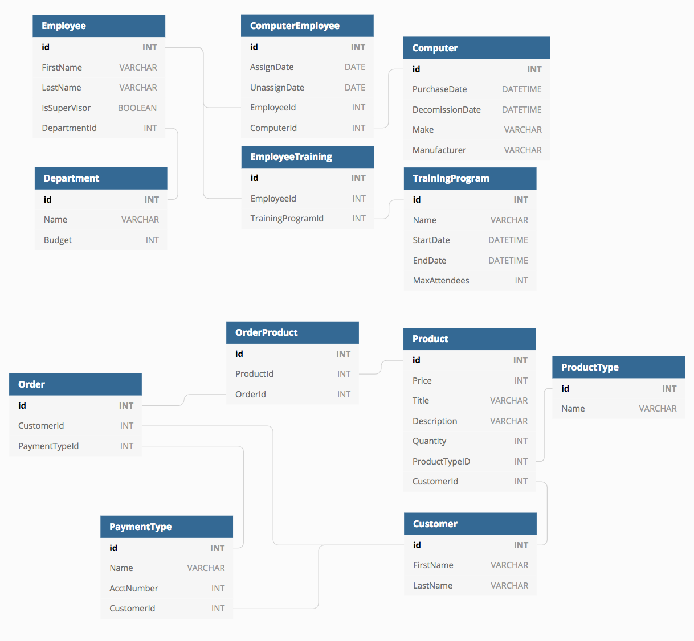

# BangazonWorkforce
Welcome to **Bangazon Workforce,** the employee management system. This application enables HR users to keep track of their employees, departments, computers and employee training programs. Bangazon Workforce is built with C# /.NET MVC and Razor pages for the UI.

## Table of Contents
- Software Requirements
- Entity Relationship Diagram
- Database Setup
- UI Walkthrough

## Software Requirements
- Sql Server Manangement Studio
- Visual Studio Community 2017
- Google Chrome

## Enitity Relationship Diagram


## Database Setup
1. In Visual Studio, right click on ```WorkforceManagement``` and select ```Add -> New Item...```
1. When the window pops up, select ```Data``` underneath ```ASP.NET Core``` and choose ```JSON File```
1. Name it ```appsettings.json``` and click ```add```
1. Open ```SSMS``` and copy the contents of the ```Server name``` text box and paste where it says ```INSERT_DATABASE_CONNECTION_HERE```
1. Replace ```INSERT_DATABASE_NAME``` with the name of your database that you've created. 

## Starting this Project

1. Clone the Ice Phantoms WorkforceManagement repo onto your machine. 
1. ```cd``` into that directory and open the project in Visual Studio.
1. Make sure the database is built on your local machine using the contents of ```Tables``` in the project root directory (see database setup above for instructions).
1. Link Visual Studio to that database by going to ```View``` and selecting the ```SQL Server Object Explorer```. 
1. Open that up and press the ```Add SQL server``` button.
1. Select ```local``` and pick the option that matches your local server.

If all went correctly, your database should be connected, and you can then run the project. To run the project, press the green "play" triangle (after selecting BangazonWorkforce) in the VS toolbar.

# Human Resources Walkthrough
## Departments

### Department List
To view all Departments, click the "Departments" link in the navigation bar. You will see the Name, Budget, and Number of Employees for each department.

### Create
You can add a new department by clicking the "Create New" link on the Departments List view. The link will show a form with an input field requesting the new department name and budget. Once submitted, you will be returned to the Department List and the new department will be displayed.

### Details
Click on the "Details" link on an individual department to see a list of that department's employees.

## Employees 

### Employee List
To see a list of employees, click the "Employees" link in the navbar. You will be presented with a table displaying the First Name, Last Name, and Department Name of each employee, as well as a checkbox indicating whether or not the employee is a supervisor.

### Create
You can add a new employee by clicking "Create New" link on the Employee List view. The link will show a form with an input field requesting the new employee's first name, last name, supervisor status, and department. Once submitted, you will be rerouted back to the Employee List page and you will see the new employee listed.

### Details
Click on the "Details" link to see a detailed view of a specific employee. You should see the employee's first name, last name, department name, and a list of training programs they are enrolled in with the details of the program listed as well. You should also see an "Edit" button at the bottom.

### Edit
When the "Edit" link is clicked, you will be redirected to a form for editing employee details, including first name, last name, supervisor status, and department.  You will also able to change the employee's assigned computer and add/remove their training programs. When you click "Save," the form will be refreshed with the newly changed data. When finished editing the employee, click the "Back to List" link to return to the Employee List view. 

## Computers

### Computer List
To see the Computer Index view, click on the Computer tab in the navbar. You will see a table that has a column for Make, Model and Employee Assigned. Each of these columns will be filled with the corresponding information that is sourced from the database. On the right of each row, for each Computer, you should see a hyperlink for "Detail."

### Create
From the Computers List, click the "Create New" link to show a form with corresponding computer input fields.  Once the fields have been filled, use the submit button to create a new computer (and assign it to an employee if desired).  Once submitted you will be returned to the Computers list.

### Details
Click on the Make of an indiviual computer in the Index view. The browser will show the details of the selected computer. The details will include the date of purchase of the computer, date the computer was decommissioned if applicable, the employee assigned to the computer and the model and manufacturer.

### Delete 
On the details view of a computer, click on the the "Delete" link. The user will be shown a view with the computer details and will ask for confirmation of the delete. If the user clicks "Yes," the computer is deleted and the user is taken back to the index view. However, if the computer is currently assigned or has been previously assigned to an employee, the delete is denied.

## Training Programs

### Program List
To see a list of upcoming training programs, click on the "Training Programs" link in the navbar. You'll then see a table listing each program's Name, Start Date, End Date, and Max Attendees. To see a list of _past_ training programs, click the "View Past Programs" at the bottom of the list page.

### Create
To create a new training program, click the "Create New Program" link at the top of the List page. You will need to input the Name, Start Date, End Date, and Max Number of Attendees for the new program. When done, click Save and you will be returned to the Training Program list.

### Details
To see the details of a training program, click the "Detail" link on the List page. In addition to the basic program information, you will also see a list of employees who are attending or attended that program.

### Edit
If viewing the details page of an _upcoming_ training program, you will see a "Edit" link. When you click "Edit," you will be be presented with a form to update the detail of that program. After clicking "Save," you will be returned to the training programs list page. If you are viewing a _past_ training program, you will not be able to edit that program.

### Delete
If viewing the details page of an _upcoming_ training program, you will see a "Delete" link. When you click "Delete," you will be asked to confirm the deletion. If you then click the "Delete" button, the program will be deleted from the system and you will be returned to the training programs list. If you are viewing a _past_ training program, you will not be able to delete that program.
